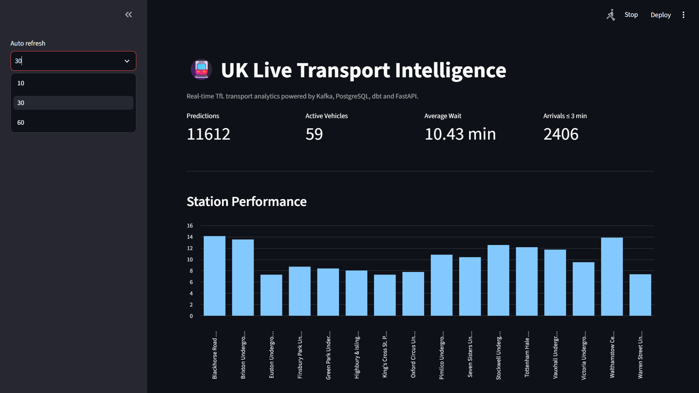
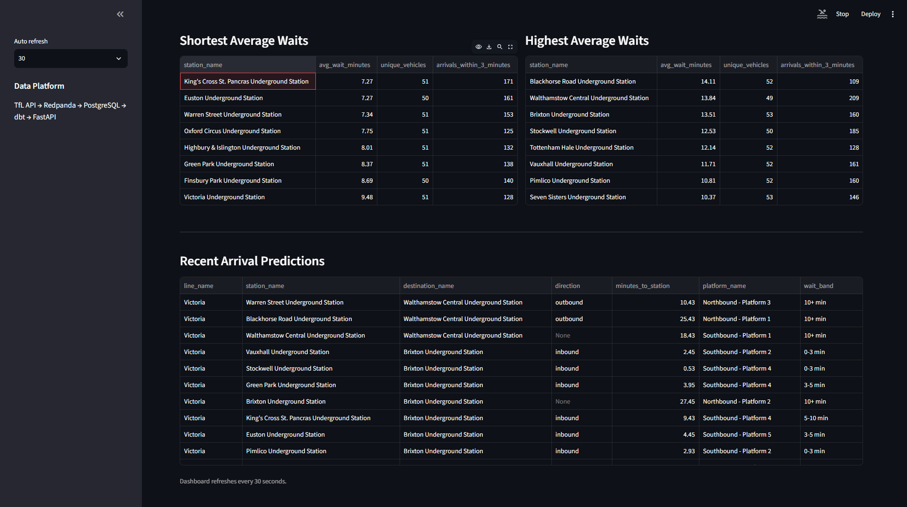

# 🚇 UK Live Transport Intelligence

[](https://github.com/Banoth281/uk-live-transport-intelligence/actions/workflows/ci.yml)


A real-time data engineering platform that ingests live Transport for London (TfL) arrival predictions, streams events through Redpanda/Kafka, stores them in PostgreSQL, transforms the data with dbt, exposes analytical endpoints through FastAPI, and presents transport intelligence through an interactive Streamlit dashboard.

---

## 📌 Project Overview

UK Live Transport Intelligence demonstrates an end-to-end streaming data platform built around real public transport data.

The platform continuously collects TfL arrival predictions and converts raw operational events into analytics such as:

- Live arrival predictions
- Active vehicle counts
- Average passenger wait times
- Arrivals within three minutes
- Station-level performance
- Line-level performance
- Vehicle and destination information
- Wait-time bands

The project demonstrates practical skills in streaming ingestion, event-driven architecture, data modelling, analytics engineering, API development, containerisation and CI/CD.

---

## 🏗️ Architecture

```text
                  Transport for London API
                            │
                            ▼
                   Python TfL Ingestion
                            │
                            ▼
                   Redpanda / Kafka
                  transport.arrivals
                            │
                            ▼
                    Python Consumer
                            │
                            ▼
                      PostgreSQL
                      raw arrivals
                            │
                            ▼
                           dbt
                ┌───────────┼────────────┐
                ▼           ▼            ▼
          fact_arrivals   station      line
                         performance  performance
                │
                ▼
             FastAPI
                │
                ▼
        Streamlit Dashboard
```

### Data flow

**TfL API → Python → Redpanda/Kafka → PostgreSQL → dbt → FastAPI → Streamlit**

---

## ⚡ Real-Time Streaming

The producer periodically retrieves live arrival predictions from the TfL API and publishes validated events to the Kafka-compatible topic:

```text
transport.arrivals
```

Each event contains information such as:

```json
{
  "vehicle_id": "203",
  "line_id": "victoria",
  "line_name": "Victoria",
  "station_name": "Pimlico Underground Station",
  "destination_name": "Walthamstow Central Underground Station",
  "direction": "outbound",
  "time_to_station": 120,
  "mode_name": "tube",
  "platform_name": "Northbound - Platform 1"
}
```

The consumer reads the event stream and persists arrival records into PostgreSQL for downstream transformation and analytics.

---

## 🗄️ Analytics Engineering with dbt

The project uses dbt to transform raw transport events into analytics-ready models.

### Staging

`stg_arrivals`

Cleans and standardises raw arrival data.

### Fact Model

`fact_arrivals`

Provides enriched arrival-level records including calculated wait-time information.

### Analytical Marts

`line_performance`

Aggregates metrics including:

- Prediction count
- Station count
- Unique vehicles
- Average wait time
- Minimum and maximum wait
- Arrivals within three minutes

`station_performance`

Provides station-level metrics including:

- Prediction count
- Unique vehicles
- Average wait time
- Short-wait arrivals

---

## 🧪 Data Quality

dbt tests validate critical analytical fields and model integrity.

Current test suite:

```text
PASS=21
WARN=0
ERROR=0
SKIP=0
TOTAL=21
```

Tests include:

- `not_null`
- `unique`
- Arrival ID validation
- Station validation
- Line validation
- Wait-time validation
- Analytical model validation

---

## 📊 Dashboard

The Streamlit dashboard provides a real-time analytical view of TfL transport data, refreshing automatically every 30 seconds.

### Live Transport Overview

The dashboard displays key operational metrics including:

- Total arrival predictions
- Active vehicles
- Average passenger wait time
- Arrivals within three minutes
- Station-level performance



### Station & Arrival Analytics

The platform also provides deeper operational analytics, including:

- Stations with the shortest average waiting times
- Stations with the highest average waiting times
- Unique vehicle counts by station
- Arrivals within three minutes
- Recent arrival predictions
- Destination and direction information
- Platform information
- Wait-time classification


---

## 🔌 FastAPI

FastAPI provides programmatic access to the transformed transport data.

Example endpoint:

```http
GET /arrivals/recent?limit=5
```

Example response:

```json
{
  "line_name": "Victoria",
  "station_name": "Euston Underground Station",
  "destination_name": "Brixton Underground Station",
  "minutes_to_station": 2.27,
  "wait_band": "0-3 min"
}
```

Interactive API documentation is available locally at:

```text
http://127.0.0.1:8000/docs
```

---

## 🛠️ Technology Stack

| Technology | Purpose |
|---|---|
| Python | Ingestion, transformation and streaming |
| TfL Unified API | Live transport arrival data |
| Redpanda / Kafka | Event streaming |
| PostgreSQL | Operational and analytical storage |
| dbt | Data transformation and testing |
| FastAPI | Analytical REST API |
| Streamlit | Interactive dashboard |
| Docker Compose | Local infrastructure orchestration |
| GitHub Actions | Continuous integration |
| Git | Version control |

---

## 📁 Project Structure

```text
uk-live-transport-intelligence/
│
├── .github/
│   └── workflows/
│       └── ci.yml
│
├── dashboard/
│   └── app.py
│
├── dbt/
│   └── transport_analytics/
│       ├── models/
│       │   ├── staging/
│       │   └── marts/
│       └── dbt_project.yml
│
├── docs/
│   └── images/
│       └── dashboard.png
│
├── sql/
│   ├── init.sql
│   └── 002_add_event_key.sql
│
├── src/
│   ├── api/
│   │   └── main.py
│   ├── ingestion/
│   │   └── tfl_client.py
│   ├── processing/
│   │   ├── models.py
│   │   └── transform.py
│   └── streaming/
│       ├── producer.py
│       └── consumer.py
│
├── .env.example
├── .gitignore
├── docker-compose.yml
├── requirements.txt
└── README.md
```

---

## 🚀 Running Locally

### 1. Clone the Repository

```bash
git clone https://github.com/Banoth281/uk-live-transport-intelligence.git
cd uk-live-transport-intelligence
```

### 2. Create a Virtual Environment

Windows PowerShell:

```powershell
python -m venv .venv
.\.venv\Scripts\Activate.ps1
```

### 3. Install Dependencies

```powershell
pip install -r requirements.txt
```

### 4. Configure Environment Variables

Copy:

```text
.env.example
```

to:

```text
.env
```

Add the required TfL credentials and local configuration.

**Never commit `.env` or API credentials to GitHub.**

### 5. Start Infrastructure

```powershell
docker compose up -d
```

Check the containers:

```powershell
docker compose ps
```

### 6. Start the Producer

```powershell
python -m src.streaming.producer
```

The producer continuously polls TfL and publishes arrival events to:

```text
transport.arrivals
```

### 7. Start the Consumer

Open another terminal:

```powershell
python -m src.streaming.consumer
```

The consumer reads Kafka events and stores them in PostgreSQL.

### 8. Run dbt

```powershell
cd dbt\transport_analytics
dbt run
dbt test
```

A successful test run should report:

```text
PASS=21
WARN=0
ERROR=0
SKIP=0
TOTAL=21
```

Return to the repository root:

```powershell
cd ..\..
```

### 9. Start FastAPI

```powershell
uvicorn src.api.main:app --reload --port 8000
```

Open:

```text
http://127.0.0.1:8000/docs
```

### 10. Start the Dashboard

Open another terminal from the repository root:

```powershell
streamlit run dashboard/app.py
```

---

## 🔄 Continuous Integration

GitHub Actions automatically runs validation when changes are pushed to the `main` branch or submitted through a pull request.

The CI pipeline validates the Python source code and project dependencies, helping ensure that changes do not break the application.

---

## 🔐 Security

Sensitive credentials are managed through environment variables.

The following files and directories are excluded from Git:

```text
.env
.venv/
__pycache__/
dbt/**/target/
dbt/**/logs/
```

Only `.env.example` is committed as a configuration template.

---

## 🎯 Engineering Skills Demonstrated

This project demonstrates:

- Real-time data ingestion
- Kafka-compatible event streaming
- Producer/consumer architecture
- PostgreSQL data modelling
- SQL analytics
- dbt transformation pipelines
- Automated data-quality testing
- REST API development
- Interactive analytical dashboards
- Docker-based infrastructure
- Environment and secret management
- GitHub Actions CI/CD
- End-to-end data pipeline design

---

## 📈 Future Improvements

Potential extensions include:

- Support for additional TfL lines and transport modes
- Historical trend analysis
- Service disruption ingestion
- Delay and anomaly detection
- Prometheus and Grafana monitoring
- Cloud deployment
- Data warehouse integration
- Automated dbt execution
- Infrastructure health monitoring

---

## 👤 Author

**Santhosh Banoth**

MSc Advanced Computer Science  
University of Liverpool

GitHub: [Banoth281](https://github.com/Banoth281)

---

## 📄 Data Source

Transport data is obtained from the Transport for London Unified API.

This project is intended for educational, portfolio and data-engineering demonstration purposes.